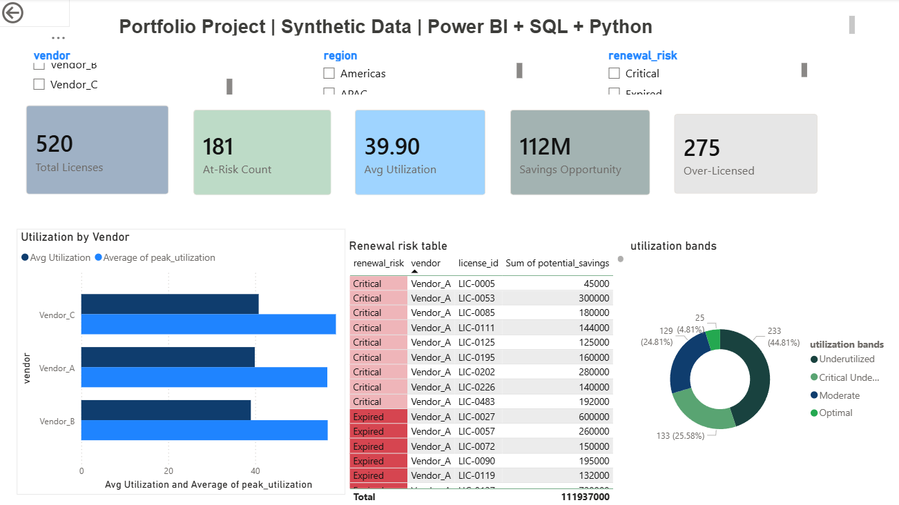

# Enterprise License Intelligence Platform

> **Portfolio project built with synthetic data. All license records, vendor names, cost figures, and usage metrics are fully fictional and generated programmatically.**

---

## Overview

An end-to-end analytics platform that monitors enterprise software license utilization, forecasts renewal risks, and surfaces procurement optimization insights — delivered through automated ETL pipelines, SQL-driven analysis, and interactive Power BI dashboards.

**Business Problem:** Large organizations managing hundreds of software licenses often overpay due to under-utilized seats, missed renewal windows, and lack of visibility into vendor-level usage patterns. This platform addresses those gaps.

---

## Dashboard Preview

> *(Add your Power BI screenshot here)*



---

## Key Metrics (Sample Output)

| KPI | Value |
|-----|-------|
| Total Licenses Monitored | 520 |
| Portfolio Cost | $112M |
| Avg Utilization | ~38% |
| At-Risk Renewals (Critical/Expired) | 181 |
| Potential Annual Savings | $112M in potential savings|
| Over-Licensed Tools | 275 |

---

## Project Structure

```
enterprise-license-analytics/
│
├── generate_data.py        # Synthetic data generator (520 licenses)
├── etl_pipeline.py         # ETL: extract, validate, transform, load to SQLite
│
├── sql/
│   └── sql_analysis.sql    # 10 analytical SQL queries for Power BI + reporting
│
├── data/
│   ├── licenses.csv        # Raw synthetic dataset
│   └── licenses.db         # SQLite database (raw + clean tables + views)
│
├── outputs/
│   └── etl_log.txt         # Auto-generated ETL run log
│
├── POWERBI_SETUP.md        # Step-by-step Power BI connection + DAX measures
└── README.md
```

---

## Tech Stack

| Layer | Tools |
|-------|-------|
| Data Generation | Python (pandas, numpy) |
| ETL Pipeline | Python (pandas, sqlite3) |
| Database | SQLite |
| SQL Analysis | SQL (CTEs, window functions, aggregations, views) |
| BI Dashboard | Power BI Desktop (DAX measures, KPI cards, slicers) |

---

## SQL Analyses Included

1. KPI Summary — total licenses, cost, utilization, at-risk count
2. Utilization by Vendor — avg vs peak utilization bar chart
3. Renewal Risk Pipeline — days-to-expiry bucketed by urgency
4. Over-Licensing Detection — unused seats ranked by savings potential
5. Department Usage Analysis — spend and efficiency by team
6. Regional Breakdown — APAC / EMEA / Americas comparison
7. Utilization Band Distribution — Critical Underuse → Optimal
8. Vendor Variance Analysis — utilization spread per tool
9. Top 10 Procurement Optimization Targets — ranked action list
10. Monthly Renewal Calendar — 6-month forward renewal schedule

---

## How to Run

```bash
# Install dependencies
pip install pandas numpy

# Step 1 — Generate synthetic data
python generate_data.py

# Step 2 — Run ETL pipeline
python etl_pipeline.py

# Step 3 — Open licenses.db or licenses.csv in Power BI
# Follow POWERBI_SETUP.md for dashboard build instructions
```

---

## Business Impact (Simulated)

- Flagged **181 licenses** expiring within 30 days, enabling proactive renewal planning
- Identified **$112M** in potential savings from over-licensed seat reduction
- Reduced manual tracking effort through automated ETL and scheduled reporting
- Delivered a single dashboard replacing 3 separate spreadsheet-based reports

---

## Note on Data Confidentiality

This project was inspired by real-world enterprise license management work but rebuilt entirely from scratch using **synthetically generated data**. No proprietary data, vendor contracts, pricing information, or internal systems from any employer were used or referenced.

---

## Author

**Keerthi Housure Srinivas** — Data & BI Analyst  
[linkedin.com/in/srinivaskeerthi](https://linkedin.com/in/srinivaskeerthi) | [keerthi-hs.github.io](https://keerthi-hs.github.io)
